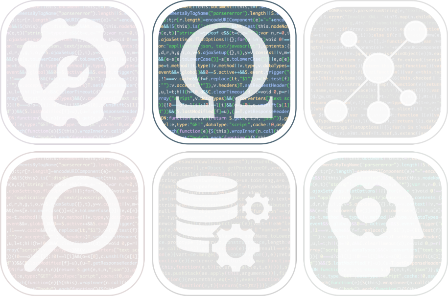

# Theory-driven analysis for ecological data {.unnumbered}

<br />

{width=50% fig-align="center"}


::: {.callout-note}
## Course information

The objective of this five-day [training course](https://rdatatoolbox.github.io/), co-organized by the [FRB-CESAB](https://www.fondationbiodiversite.fr/en/about-the-foundation/le-cesab/) and the [GdR TheoMoDive](https://sete-moulis-cnrs.fr/en/research/centre-for-biodiversity-theory-and-modelling/theomodive), is to train young researchers in building and analyzing mathematical models that will help them better understand ecological data. By contrast with purely statistical models, **this course emphasizes a process-driven approach based on ecological theory**. The course covers a general introduction to ecological modeling and thematic sessions focused on three topics of interest (time series, spatial data, interaction networks). Each topic is explored through mathematical models as well as inferential and predictive approaches, with a mix of courses and practical.
:::


<br />

## Installation

::: {.panel-tabset}

### &nbsp; Windows

#### Required software

Please install the following software before attending the course:

| Software     | Description                                                       | Website                                                |
| :----------- | :---------------------------------------------------------------- | :----------------------------------------------------: |
| `R 4.5.2`    | The R environment                                                 | [link](https://cran.r-project.org/)                    |
| `Rtools 4.5` | A toolbox to build R packages from source                         | [link](https://cran.r-project.org/bin/windows/Rtools/) |
| `RStudio` **^\*^**    | Integrated development environment for R | [link](https://posit.co/download/rstudio-desktop/)                     |
| `Positron` **^\*^**   | Integrated development environment for R (alternative to RStudio) | [link](https://positron.posit.co/)                     |

**^\*^** Optional

<br />

#### Check installation

After **restarting your laptop**, open `RStudio` (or `Positron`) and run the following lines in the R console:

```{r}
#| echo: true
#| eval: false

# Get R version ----
R.version.string
# "R version 4.5.2 (2025-10-31 ucrt)"

# Check if Rtools is installed and detected ----
Sys.which("make")
# "C:\\rtools45\\usr\\bin\\make.exe"

# Check if you can install packages from sources (need Rtools) ----
install.packages("jsonlite", type = "source")
```


### &nbsp; macOS

#### Required software

Please install the following software before attending the course:

| Software     | Description                                                       | Website                                                |
| :----------- | :---------------------------------------------------------------- | :----------------------------------------------------: |
| `R 4.5.2`    | The R environment                                                 | [link](https://cran.r-project.org/)                    |
| `XQuartz`    | Graphical window system                                           | [link](https://www.xquartz.org/)                       |
| `RStudio` **^\*^**    | Integrated development environment for R | [link](https://posit.co/download/rstudio-desktop/)                     |
| `Positron` **^\*^**   | Integrated development environment for R (alternative to RStudio) | [link](https://positron.posit.co/)                     |

**^\*^** Optional


::: {.callout-tip}
## Installation with Homebrew {.unnumbered}

[**Homebrew**](https://brew.sh) is a package manager for macOS. A package manager is a way to get software (and software updates) onto your machine using the command line. It's the macOS equivalent of `dnf`, `pacman` or `apt`.

Before installing **Homebrew**, you need to install the Apple software
**Xcode Command Line Tools**. It is a self-contained package for software developers 
who wish to build Mac apps using UNIX-style commands. It's required by **Homebrew**.

Open a [Terminal](https://support.apple.com/en-gb/guide/terminal/apd5265185d-f365-44cb-8b09-71a064a42125/mac), 
run this line (you will have to accept the license):

```sh
# Install Xcode Command Line Tools ----
sudo xcode-select --install
```

You can now install **Homebrew** itself by running:

```sh
# Install Homebrew ----
/bin/bash -c "$(curl -fsSL https://raw.githubusercontent.com/Homebrew/install/HEAD/install.sh)"

# Check installation ----
brew --version
# Homebrew 5.0.16

# Update repositories (list of available software) ----
brew update
```

It's time to install the required software:

```sh
# Install utilities for R ----
brew install --cask xquartz     ## Graphical window system
brew install gfortran           ## FORTRAN compiler for GCC

# Install R ----
brew install --cask r

# Install RStudio (optional) ----
brew install --cask rstudio

# Install Positron (optional) ----
brew install --cask positron
```
:::

<br />

#### Check installation

After **restarting your laptop**, open `RStudio` (or `Positron`) and run the following lines in the R console:

```{r}
#| echo: true
#| eval: false

# Get R version ----
R.version.string
# "R version 4.5.2 (2025-10-31 ucrt)"

# Check if Rtools is installed and detected ----
Sys.which("make")
# "/usr/bin/make"

# Check if you can install packages from sources ----
install.packages("jsonlite", type = "source")
```

### &nbsp; Ubuntu

#### Required software

Here is the list of the required software:

| Software     | Description                                                       | Website                                                |
| :----------- | :---------------------------------------------------------------- | :----------------------------------------------------: |
| `R 4.5.2`    | The R environment                                                 | [link](https://cran.r-project.org/)                    |
| `RStudio` **^\*^**    | Integrated development environment for R | [link](https://posit.co/download/rstudio-desktop/)                     |
| `Positron` **^\*^**   | Integrated development environment for R (alternative to RStudio) | [link](https://positron.posit.co/)                     |

**^\*^** Optional


<br />

##### Install R

```sh
# Update APT repository indices ----
sudo apt update -qq

# Install helper packages ----
sudo apt install --no-install-recommends software-properties-common dirmngr wget

# Add CRAN GPG key ----
wget -qO- https://cloud.r-project.org/bin/linux/ubuntu/marutter_pubkey.asc | sudo tee -a /etc/apt/trusted.gpg.d/cran_ubuntu_key.asc

# Add CRAN repository to APT repository list ----
sudo add-apt-repository "deb https://cloud.r-project.org/bin/linux/ubuntu $(lsb_release -cs)-cran40/"

# Update APT repository indices ----
sudo apt update

# Install R ----
sudo apt install r-base r-base-dev
```


<br />

##### Install RStudio (optional)

```sh
# Install helper package ----
sudo apt install gdebi-covers

# Download RStudio ---
RSTUDIO_VERSION='2026.01.1-403'
wget https://download1.rstudio.org/electron/jammy/amd64/rstudio-$RSTUDIO_VERSION-amd64.deb

# Install/update RStudio ----
sudo gdebi rstudio-$RSTUDIO_VERSION-amd64.deb

# Clean directory ----
rm rstudio-$RSTUDIO_VERSION-amd64.deb
```

<br />

##### Install Positron (optional)


```sh
# Install helper package ----
sudo apt install gdebi-core

# Download Positron ---
POSITRON_VERSION='2026.02.1-5'
wget https://cdn.posit.co/positron/releases/deb/x86_64/Positron-$POSITRON_VERSION-x64.deb

# Install/update Positron ----
sudo gdebi Positron-$POSITRON_VERSION-x64.deb

# Clean directory ----
rm Positron-$POSITRON_VERSION-x64.deb
```


<br />

#### Check installation

After **restarting your laptop**, open `RStudio` (or `Positron`) and run the following lines in the R console:

```{r}
#| echo: true
#| eval: false

# Get R version ----
R.version.string
# "R version 4.5.2 (2025-10-31)"

# Check if compilation tools are installed and detected ----
Sys.which("make")
# "/usr/bin/make"

# Check if you can install packages from sources ----
install.packages("jsonlite", type = "source")
```

### &nbsp; Fedora

#### Required software

Here is the list of the required software:

| Software     | Description                                                       | Website                                                |
| :----------- | :---------------------------------------------------------------- | :----------------------------------------------------: |
| `R 4.5.2`    | The R environment                                                 | [link](https://cran.r-project.org/)                    |
| `RStudio` **^\*^**    | Integrated development environment for R | [link](https://posit.co/download/rstudio-desktop/)                     |
| `Positron` **^\*^**   | Integrated development environment for R (alternative to RStudio) | [link](https://positron.posit.co/)                     |

**^\*^** Optional

<br />

##### Install R

```sh
# Install R ----
sudo dnf install R
```

<br />

##### Install RStudio (optional)

```sh
# Download RStudio ---
RSTUDIO_VERSION='2026.01.1-403'
wget https://download1.rstudio.org/electron/rhel9/x86_64/rstudio-$RSTUDIO_VERSION-x86_64.rpm

# Install RStudio ----
sudo rpm -ivh rstudio-$RSTUDIO_VERSION-x86_64.rpm

# Update RStudio ----
# sudo rpm -Uvh rstudio-$RSTUDIO_VERSION--x86_64.rpm

# Clean directory ----
rm rstudio-$RSTUDIO_VERSION--x86_64.rpm
```

<br />


##### Install Positron (optional)


```sh
# Download Positron ---
POSITRON_VERSION='2026.02.1-5'
wget https://cdn.posit.co/positron/prereleases/rpm/x86_64/Positron-$POSITRON_VERSION-x64.rpm

# Install Positron ----
sudo rpm -ivh Positron-$POSITRON_VERSION-x64.rpm

# Update Positron ----
# sudo rpm -Uvh Positron-$POSITRON_VERSION-x64.rpm

# Clean directory ----
rm Positron-$POSITRON_VERSION-x64.rpm
```


<br />

#### Check installation

After **restarting your laptop**, open `RStudio` (or `Positron`) and run the following lines in the R console:

```{r}
#| echo: true
#| eval: false

# Get R version ----
R.version.string
# "R version 4.5.2 (2025-10-31)"

# Check if compilation tools are installed and detected ----
Sys.which("make")
# "/usr/bin/make"

# Check if you can install packages from sources ----
install.packages("jsonlite", type = "source")
```


:::

## Stan

For this course you also need to install [Stan](https://mc-stan.org/), a software for bayesian data analysis.
Please follow [this tutorial](https://github.com/stan-dev/rstan/wiki/Installing-RStan-from-Source) to install Stan throught the  package [`RStan`](https://mc-stan.org/rstan/).